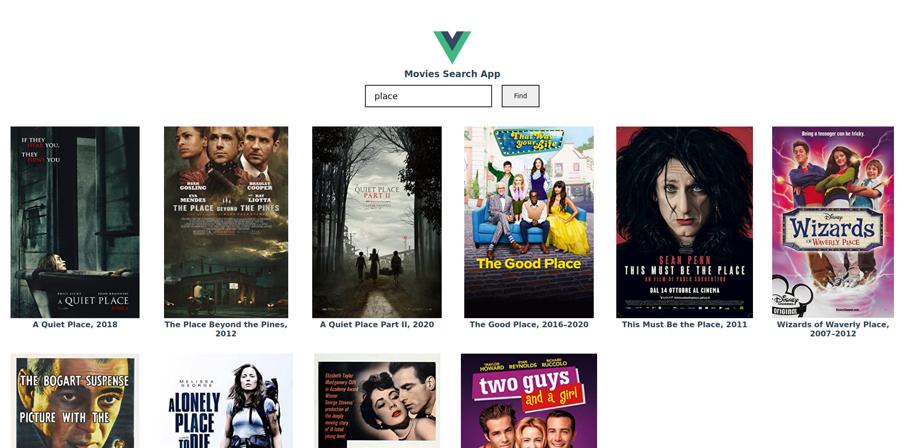

# vue-movie-search-app - [Demo](https://nulloneguy.github.io/vue-search-movies-app/)
Simple vue search movies app with axios

## Screenshot




## Project setup

```
yarn install
```

### Compiles and hot-reloads for development

```
yarn serve
```

### Compiles and minifies for production

```
yarn build
```

### Lints and fixes files

```
yarn lint
```

### Customize configuration

See [Configuration Reference](https://cli.vuejs.org/config/).
